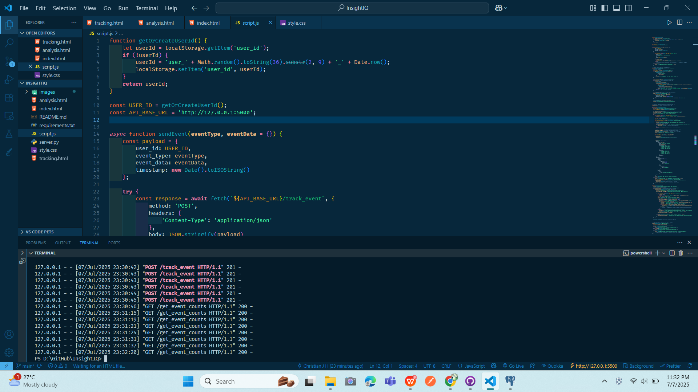

# 📊 InsightIQ — Simulasi & Analisis Perilaku Pengguna Secara Lokal

# 📊 **InsightIQ — Simulasi & Analisis Perilaku Pengguna Secara Lokal**

*InsightIQ adalah platform untuk memantau dan menganalisis perilaku pengguna di aplikasi, seperti klik, scroll, dan waktu interaksi — semuanya **disimpan secara lokal** di PostgreSQL dan divisualisasikan lewat dashboard interaktif.*

*Built with the tools and technologies:*

---

## 📸 Tampilan Tambahan

### Input Halaman

### Script Tracking

---

